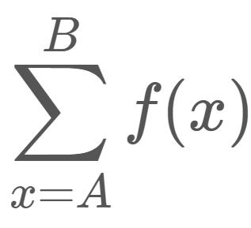

## 2진수와 분할정복

---

 [출처 : 1의 개수 세기  https://www.acmicpc.net/problem/9527](https://www.acmicpc.net/problem/9527)
---
<table>
<thead>
  <tr>
    <th>시간 제한</th>
    <th>메모리 제한</th>
  </tr>
</thead>
<tbody>
  <tr>
    <td>1초</td>
    <td>128 MB</td>
  </tr>
</tbody>
</table>

---

# 문제
두 자연수 A, B가 주어졌을 때, A ≤ x ≤ B를 만족하는 모든 x에 대해 x를 이진수로 표현했을 때 1의 개수의 합을 구하는 프로그램을 작성하시오.

즉, f(x) = x를 이진수로 표현 했을 때 1의 개수라고 정의하고, 아래 식의 결과를 구하자.<br>


---

# 입력

첫 줄에 두 자연수 A, B가 주어진다. (1 ≤ A ≤ B ≤ 10^16)

---

# 출력

1의 개수를 세어 출력한다.

---

# 아이디어

2진법 문제의 경우 직관적인 10진법으로 바꿔 생각해보는게 도움이 된다. 나같은 경우는 N자리수 자연수 까지 1의 개수를 세는것으로 생각했다.<br>

예를들어 99 까지의 1의 개수를 세면<br>
01<br>
10<br>
11<br>
12<br>
13<br>
.<br>
.<br>
.<br>
21<br>
.<br>
.<br>
.<br>
31<br>
.<br>
.<br>
.<br>
91<br>

10의자리수에 1이 10번, 1의 자리수에 1이 10번 총 20번 나오게 된다.

2진법으로 7까지의 1의 개수를 세어보면<br>
421(자릿수)<br>
001 = 1<br>
010 = 2<br>
011 = 3<br>
100 = 4<br>
101 = 5<br>
110 = 6<br>
111 = 7

1의 자리수에 1 4번, 2의 자리수에 1 4번, 4의 자리수에 1 4번 총 12번 나오게 된다.

좀 더 일반화해서 2진법의 2^10 - 1 = 1111111111(2) 길이가 10인 수 까지의 1의 개수를 세어보면<br>
1의 자리수에 0 2^8개, 1 2^8개 총 2^9 수가 오며,<br>
1의 자리수에 1 2^8개, 2의 자리수에 1 2^8개, ... 2^9의 자리수에 1 2^8개의 1<br>
1은 총 (2^8) * 9개가 존재한다.<br>

### 완전 일반화해보면, 2^N - 1 까지의 1의 합은 (2^(N-2)) * (N-1)이다.

### 이러한 부분 일반화는 문제를 재귀적으로 해결함에 도움이 될것이다.

또 다음 예시로
111000000111(2) 이러한 12자리 2진수가 있다고 하자.<br>
111000000111(2) 까지 1의 개수를 더할 것 이다.<br>
제일 앞에있는, 즉 가장 높은 자리수의 1은 몇번 존재하는지 세는 방법은<br>
100000000001(2) ~ 111000000111(2)<br>
즉, 가장 높은 자리수 1은 111000000111(2) - 2^11 = 11000000111(2)번 존재한다.<br>

## 의사코드를 써보면 다음과 같다.
```agsl
function sumAllBinaryOne(number)
    if number = 1 or number = 0
        return number
    length = number.BinaryLength
    return (2^(length-2)) * (length-1)
    + num - 2^(length-1) + 1
    + sumAllBinaryOne(number - 2^(length-1))
```


---

# 코드
## 분할정복(?)과 재귀를 이용
[백준에서 코드 보기 : http://boj.kr/31279aee4f8f4314942262ce82ef9cc8](http://boj.kr/31279aee4f8f4314942262ce82ef9cc8)
```java
import java.io.BufferedReader;
import java.io.IOException;
import java.io.InputStreamReader;
import java.util.StringTokenizer;

public class Main {
    private static long A,B;
    private static int getBinaryLength(long num){
        int length = 0;
        while (num != 0){
            length++;
            num >>= 1;
        }
        return length;
    }
    private static long count(long num){
        if (num < 2)
            return num;
        int numlen = getBinaryLength(num);
        return (1L <<(numlen-2))*(numlen-1) + num - (1L <<(numlen-1)) + 1 + count(num - (1L <<(numlen-1)));
    }
    public static void main(String[] args) throws IOException {
        BufferedReader br = new BufferedReader(new InputStreamReader(System.in));
        StringTokenizer st = new StringTokenizer(br.readLine());
        A = Long.parseLong(st.nextToken());
        B = Long.parseLong(st.nextToken());
        System.out.println(count(B) - count(A-1));
    }
}
```


---
# 결론

O(1)로 한번에 구할 수 있는 일반항을 구할 수 있으면 좋지만, 부분적인 일반항이라도 세울 수 있다면, 재귀, 반복문, 점화식 등을 이용하면 원하는 값을 구할 수 있다는 것을 알았다.